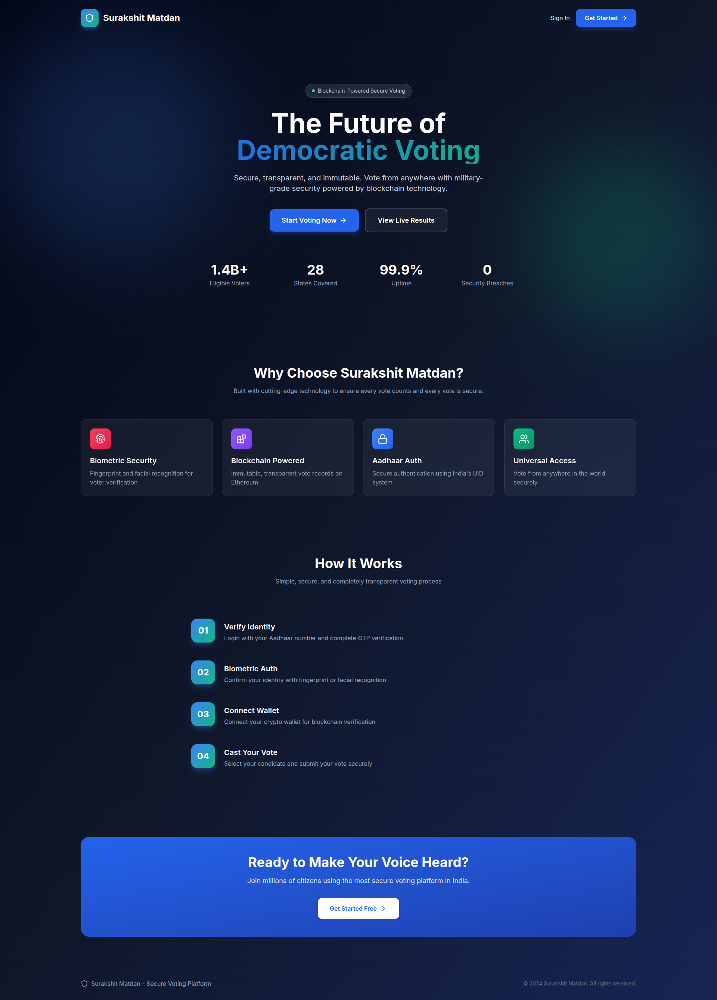
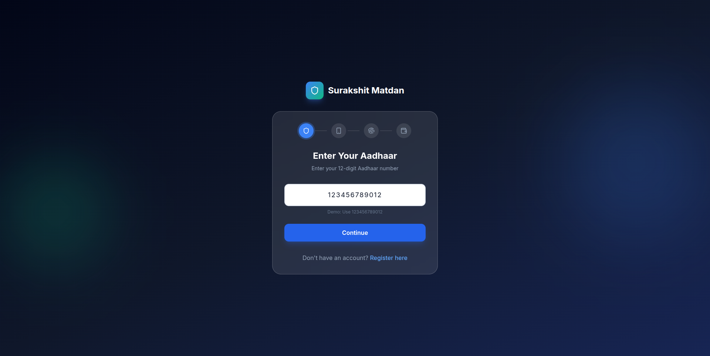
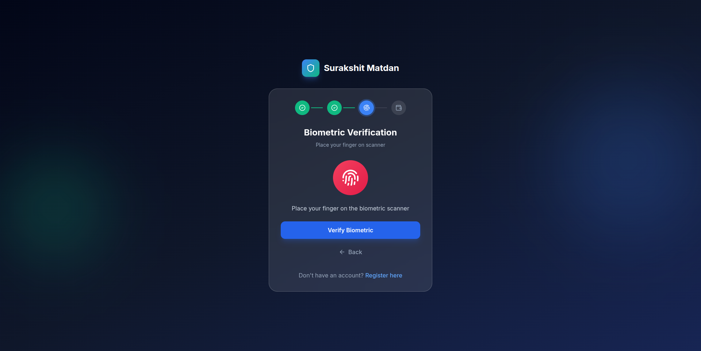
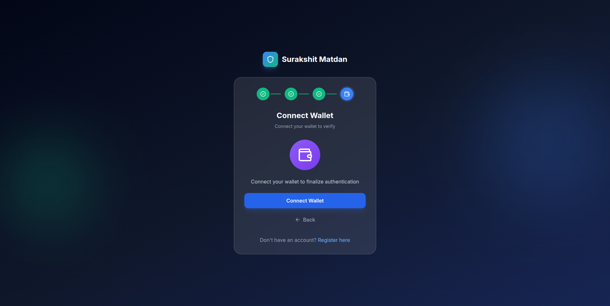
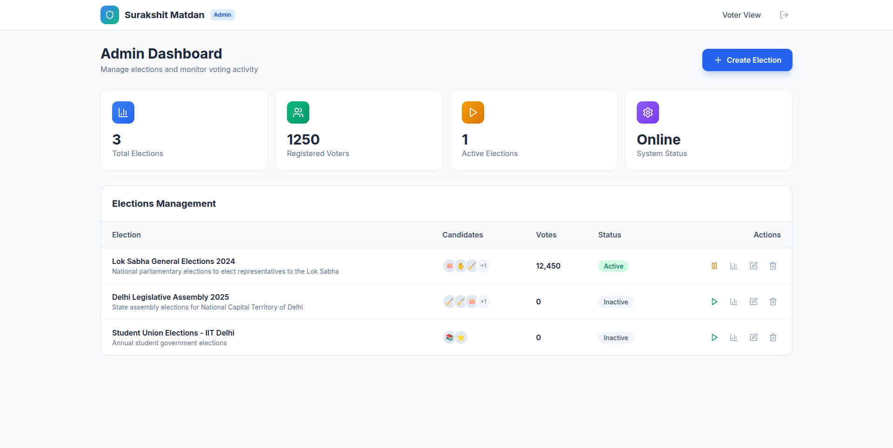
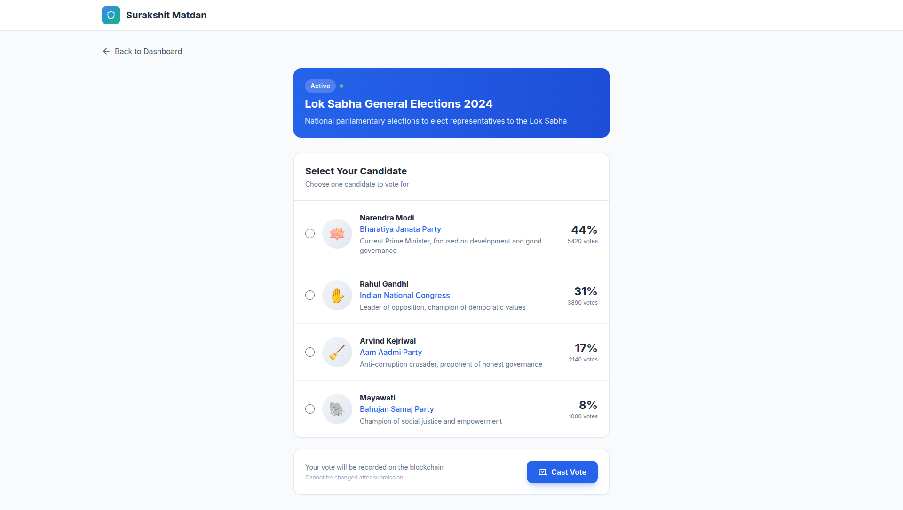

<p align="center">
  
</p>

<h1 align="center">Surakshit Matdan</h1>

<p align="center">
  <strong>Secure Blockchain Voting System</strong><br>
  A hackathon-ready prototype for secure, transparent, and immutable voting powered by <b>ZKP (Zero Knowledge Proof)</b> and <b>Quantum-Resistant</b> blockchain technology.
</p>

<p align="center">
  <a href="https://github.com/lankabhedi/surakshit-matdan">
    
  </a>
  <a href="https://github.com/lankabhedi/surakshit-matdan/blob/main/LICENSE">
    
  </a>
</p>

<p align="center">
  
</p>

<p align="center">
  <small>Organized by Municipal Corporation of Delhi (MCD)</small><br>
  
</p>

---

## 🏆 Hackathon Details

| | |
|---|---|
| **Hackathon** | India Innovates 2026 |
| **Organizer** | Municipal Corporation of Delhi (MCD) |
| **Domain** | Digital Democracy |
| **Problem Statement** | Secure E-Voting System |

---

## 👥 Team

| Role | Name |
|------|------|
| **Lead** | Samnit Mehandiratta |
| Team Member | Hemlata Chaudhary |
| Team Member | Shobhit Mehandiratus |

**Team Name:** BinaryBonsai

---

<p align="center">
  
  
  
  
  
  
</p>

---

## ✨ Features

### 🖥️ CLI ZKP Voting System (NEW!)
**Interactive command-line interface for secure voting:**
- **Aadhaar ZIP Integration** - Direct UIDAI XML parsing with password authentication
- **ZKP Proof Generation** - Zero-Knowledge proofs for voter eligibility
- **Nullifier-Based Security** - Mathematical double-vote prevention
- **Blockchain Visualization** - View votes and published nullifiers
- **Anonymous Voting** - Vote choice never linked to identity
- **Live Results** - Real-time election outcomes

```bash
npm run zkp-interactive
```

### 🔐 Zero Knowledge Proof (ZKP) Security
- **Privacy-Preserving Verification** - Vote without revealing identity
- **Quantum-Resistant Encryption** - Future-proof cryptographic security
- **Aadhaar Integration** - Secure identity verification using India's UID system
- **OTP Verification** - One-time password sent to registered mobile
- **Biometric Auth** - Fingerprint and facial recognition
- **Wallet Connection** - MetaMask blockchain wallet integration

### 🗳️ Voting System
- **Active Elections** - Real-time display of ongoing elections
- **Candidate Selection** - Clean, intuitive voting interface
- **Vote Confirmation** - Transaction hash on blockchain
- **Live Results** - Real-time vote counting with progress bars

### 👨‍💼 Admin Panel
- **Election Management** - Create, edit, and manage elections
- **Live Monitoring** - Track voting activity in real-time
- **Result Analytics** - Detailed candidate performance
- **Election Control** - Start/stop elections instantly

### 🎨 UI/UX
- **Modern Design** - Beautiful gradient themes
- **Smooth Animations** - Framer Motion transitions
- **Responsive** - Works on all devices
- **Dark Theme Landing** - Eye-catching hero section

---

## 🚀 Getting Started

### Prerequisites
- Node.js 18+
- npm or pnpm

### Installation

```bash
# Clone the repository
git clone https://github.com/lankabhedi/surakshit-matdan.git

# Navigate to project
cd surakshit-matdan

# Install dependencies
npm install
```

### Development Server (Web App)

```bash
npm run dev
```

### CLI ZKP Voting System

```bash
# Start interactive CLI
npm run zkp-interactive

# Place Aadhaar ZIP files in ./aadhaar-zips/ folder
# Follow the menu to generate proofs and vote
```

### Build for Production

```bash
npm run build
```

---

## 🔑 Demo Credentials

| Role | Aadhaar Number | OTP |
|------|---------------|-----|
| Voter | `123456789012` | `123456` |
| Admin | `123456789012` | `123456` |

> **Note:** This is a prototype. For demo purposes, use OTP `123456` to verify.

---

## 🏗️ Tech Stack

| Category | Technology |
|----------|------------|
| Frontend | React 18 + TypeScript |
| Styling | Tailwind CSS 3.4 |
| Animations | Framer Motion 11 |
| State | Zustand |
| Routing | React Router 6 |
| Blockchain | Ethers.js |
| CLI | Node.js + TypeScript |
| ZKP | SHA-3, Nullifiers |
| XML Parsing | fast-xml-parser |
| Build | Vite 5 |

---

## 📁 Project Structure

```
surakshit-matdan/
├── src/
│   ├── cli/               # CLI ZKP Voting System (NEW!)
│   │   └── zkp-vote-interactive.ts
│   ├── components/        # Reusable components
│   │   └── VotedModal.tsx
│   ├── pages/             # Page components
│   │   ├── Landing.tsx
│   │   ├── Login.tsx
│   │   ├── Register.tsx
│   │   ├── VoterDashboard.tsx
│   │   ├── Vote.tsx
│   │   ├── AdminDashboard.tsx
│   │   └── Results.tsx
│   ├── store/             # State management
│   │   └── useStore.ts
│   ├── data/              # Mock data
│   │   └── mockData.ts
│   ├── utils/             # Utility functions
│   │   ├── auth.ts
│   │   └── blockchain.ts
│   ├── types/             # TypeScript types
│   │   └── index.ts
│   ├── App.tsx
│   ├── main.tsx
│   └── index.css
├── public/
├── aadhaar-zips/          # Aadhaar ZIP files (git-ignored)
├── .zkp-data/             # CLI data (git-ignored)
├── index.html
├── package.json
├── CLI_README.md          # CLI documentation
├── DEMO_GUIDE.md          # Hackathon demo script
└── vite.config.ts
```

---

## 📸 Screenshots

### 1. Landing Page


### 2. Login - Aadhaar Verification


### 3. Login - OTP Verification


### 4. Login - Biometric & Wallet


### 5. Admin Dashboard


### 6. Vote - Candidate Selection


---

## 🔒 Security Features

### Web App
- ✅ Aadhaar-based identity verification
- ✅ OTP validation
- ✅ Biometric authentication support
- ✅ Blockchain immutable records
- ✅ Wallet-based transaction verification

### CLI ZKP System
- ✅ **Nullifier-based double vote prevention** - SHA-3 hash prevents duplicate voting
- ✅ **Zero-knowledge proofs** - Prove eligibility without revealing identity
- ✅ **Aadhaar ZIP parsing** - UIDAI-signed XML verification
- ✅ **Anonymous voting** - Vote choice never linked to voter
- ✅ **Public nullifier registry** - Mathematical verification
- ✅ **Receipt-based verification** - Prove your vote was counted

---

## 📚 Documentation

- **[CLI_README.md](CLI_README.md)** - Complete CLI usage guide
- **[DEMO_GUIDE.md](DEMO_GUIDE.md)** - Hackathon demo script and talking points
- **[SURAKSHIT_MATDAN_Architecture.pdf](SURAKSHIT_MATDAN_Architecture.pdf)** - System architecture

---

## 🤝 Contributing

1. Fork the repository
2. Create your feature branch (`git checkout -b feature/amazing-feature`)
3. Commit your changes (`git commit -m 'Add some amazing feature'`)
4. Push to the branch (`git push origin feature/amazing-feature`)
5. Open a Pull Request

---

## 📄 License

This project is licensed under the MIT License - see the [LICENSE](LICENSE) file for details.

---

## 🙏 Acknowledgments

- Design inspiration from modern voting systems
- Built for hackathon demonstration
- Blockchain integration with Ethers.js

---

<p align="center">
  Made with ❤️ for secure democracy
</p>

<p align="center">
  
</p>
